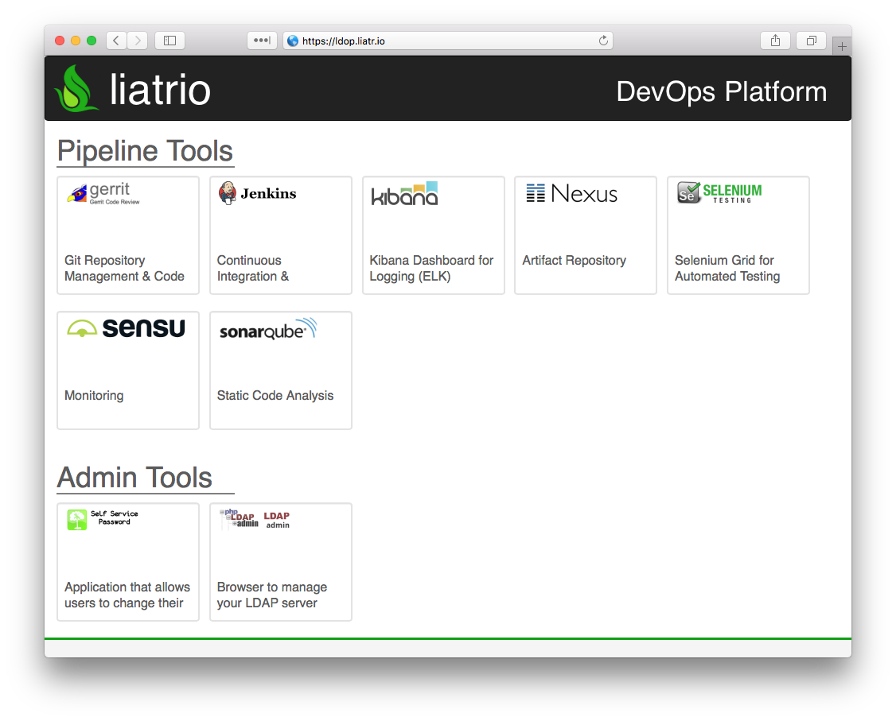

# The DevOps Platform: Overview

The DevOps Platform is a tools environment for continuously testing, releasing and maintaining applications. Reference code, delivery pipelines, automated testing and environments can be loaded in via the concept of [Cartridges](https://github.com/Accenture/adop-cartridge-skeleton).

The platform runs on a [docker container cluster](https://docs.docker.com/swarm/) so it can be stood up for evaluation purposes on just one server using local storage, or stood up in a multi-data centre cluster with distributed network storage.  It will also run anywhere that [docker runs](https://docs.docker.com/engine/installation/binaries/).

The Liatrio DevOps Platform (LDOP) is Liatrio's adaptation of this platform for use with our customers.

## What's the Difference between LDOP and ADOP?

- Version Upgrades
- Tool Differences
- Expanded AMPRS Characteristics for Enterprise Use Cases

Here is the front page:



Once you have a stack up and running, you can log in with the username and password created upon start-up.

On startup you will have an example java application job populated automatically.


Once you have explored this, the next step is to create your own Workspace and Project and then create a job using [jenkinsfiles](https://jenkins.io/doc/book/pipeline/jenkinsfile/). These jobs can be edited directly in the job configuration view with the jenkins GUI, or a URL to a git repository containing a jenkinsfile can be provided.

# Quickstart Instructions

These instructions will spin up an instance of LDOP locally:

1. Clone this repository and then in a terminal window:
    - Run:

        ```./adop compose init```

1. If all goes well you will see the following output and you can view the DevOps Platform in your browser
    ```
    ##########################################################

    SUCCESS, your new ADOP instance is ready!

    Run this command in your shell:
      source ./conf/env.provider.sh
      source credentials.generate.sh
      source env.config.sh

    You can check if any variables are missing with: ./adop compose config  | grep 'WARNING'

    Navigate to http://localhost in your browser to use your new DevOps Platform!
    Login using the following credentials:
      Username: YOUR_USERNAME
      Password: YOUR_PASSWORD
    ```

# Define Default Elastic Search Index Pattern

Kibana 4 does not provide a configuration property that allow to define the default index pattern so the following manual procedure should be adopted in order to define an index pattern:

- Navidate to Settings > Indices using Kibana dashboard
- Set index name or pattern as "logstash-\*"
- For the below drop-down select @timestamp for the Time-field name
- Click on create button


## Issues
If you have any problems with or questions about this project, please contact us through a [GitHub issue](https://github.com/Liatiro/ldop-docker-compose/issues).

## Contribute
You are invited to contribute new features, fixes, or updates, large or small; we are always thrilled to receive pull requests, and do our best to process them as fast as we can.

Before you start to code, we recommend discussing your plans through a [GitHub issue](https://github.com/Liatrio/ldop-docker-compose/issues), especially for more ambitious contributions. This gives other contributors a chance to point you in the right direction, give you feedback on your design, and help you find out if someone else is working on the same thing.
